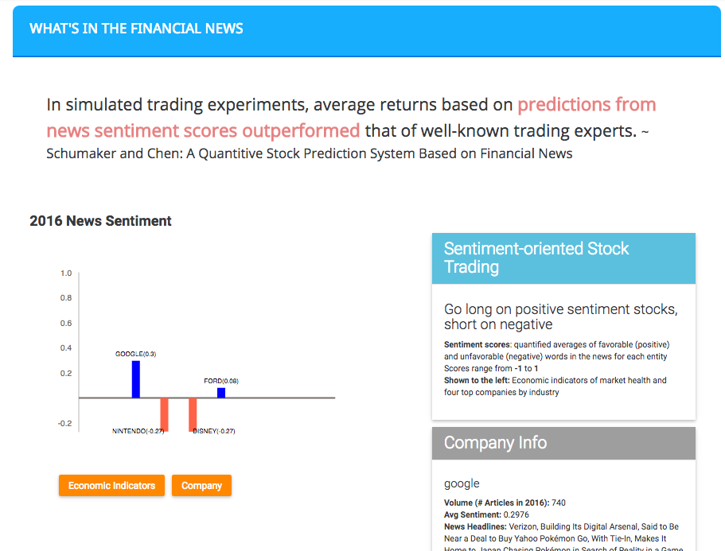
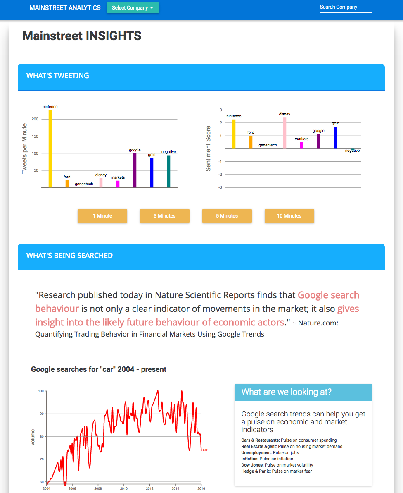

# Mainstreet Analytics

> Mainstreet Analytics is a real-time data visualization dashboard.   It collects data from Twitter API, Google Trends API, and NY Times API and uses AlchemyAPI sentiment analysis to provide company specific and overall market insights as a resource to help investors make investment decisions by "predicting the present."




## Table of Contents

1. [Usage](#Usage)
1. [Development](#development)
    1. [Installing Dependencies](#installing-dependencies)
    1. [Tasks](#tasks)
1. [Team](#team)
1. [Contributing](#contributing)

## Usage

> Some usage instructions

## Development

### Installing Dependencies

From within the root directory:

```sh
npm install
```

### Starting the Application

```sh
npm start
```

### Run tests

```sh
npm test
```

## Contributing

See [CONTRIBUTING.md](CONTRIBUTING.md) for contribution guidelines.
